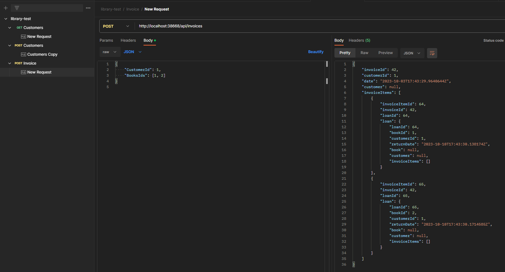

# Library Test Backend
Este es un proyecto de práctica.

## 1.1 Normalización
En base a la siguiente estructura de datos (se trata de la información de préstamos de libros de una biblioteca), realice la creación de un modelo de datos normalizado que sea capaz de soportarlo. Adjunte el Diagrama Entidad-Relación:

| Código | Título                                   | Autor                           | Editorial | Nombre del lector | Fecha de Devolución |
|--------|------------------------------------------|---------------------------------|-----------|-------------------|---------------------|
| 1001   | La uruguaya                              | Pedro Mairal                    | EMECE     | Goméz, Ana        | 01/01/2021          |
| 1004   | Salvatierra                              | Pedro Mairal                    | EMECE     | Pérez, Juan       | 02/01/2021          |
| 1004   | Salvatierra                              | Pedro Mairal                    | EMECE     | Goméz, Ana        | 01/03/2021          |
| 1005   | El funcionamiento general del mundo      | Eduardo Sacheri<br>Pedro Mairal | Planeta   | Goméz, Ana        | 01/08/2021          |
| 1006   | Ser feliz era esto                       | Eduardo Sacheri                 | Alfaguara | Sánchez, José     | 01/08/2021          |
| 1007   | Cuentos cortos                           | Eduardo Sacheri<br>Pedro Mairal<br>Hernán Casciari | Planeta   | Sánchez, José     | 01/08/2021          |


## 1.2 SQL
En base al modelo normalizado en el punto anterior, escriba las consultas SQL para obtener la siguiente información:

1. Ranking de los diez primeros libros más solicitados, incluyendo: Nombre del libro, autor, editorial y cantidad de veces que ha sido retirado. Ordenar los resultados de mayor a menor cantidad.
2. Listado de títulos y su cantidad de autores. Se debe visualizar: Título y cantidad de autores. Solo visualizar aquellos registros donde hayan más de dos autores.
3. Listado de los lectores y cuantas veces han retirado un determinado libro: Lector, libro, cantidad de retiros. 
4. Listado de libros y cuántas veces fueron retirados por mes en el último año. Contemplar aquellos meses donde no hubo retiros como 0. El resultado debe otorgar: Código de libro, Título, Mes y año, Cantidad de libros. 
5. Para cada lector, se debe visualizar cuál es su autor de preferencia (aquel autor que más libros ha retirado): Código de lector, nombre del lector, código de autor y autor.


## 2. DESARROLLO
Se deberán realizar las siguientes acciones propuestas, referidas a un sistema cuyo objetivo es la emisión de una factura (invoice) con sus correspondientes detalles (invoice items) relacionada a un cliente específico (customer).


## 2.1. BACKEND
Para alcanzar el objetivo antes mencionado, se dispondrá de una estructura de proyecto en el lenguaje .NET CORE. Dentro del proyecto, se le deberá agregar la siguiente funcionalidad dentro del/los Controllers que considere necesarios:

- Alta de Customer (Cliente)
- Obtención de listado completo de Customers (Clientes)
- Creación de una nueva Invoice (Factura) con sus correspondientes  detalles

Los puntos antes resueltos deberán ser utilizados para la resolución de la problemática propuesta en el punto siguiente.

## 2.2. FRONTEND
En base al siguiente modelo de interfaz (tentativa, aplique las mejoras que considere necesarias), se deberá seleccionar un cliente (desde un menú desplegable con la obtención de la información desde el servicio antes creado); y agregar los productos que conformarán parte de la factura (no pueden repetirse los mismos para la factura que se está confeccionando). 

Una vez concluida la carga, mediante un botón se deberá enviar la información ya validada.

## Solución
## Ejercicio 1.1


## Ejercicio 1.2.1
Ranking de los diez primeros libros más solicitados, incluyendo: Nombre del libro, autor, editorial y cantidad de veces que ha sido retirado. Ordenar los resultados de mayor a menor cantidad.

```sql
SELECT 
    b.title AS 'Nombre del libro',
    a.name AS 'Autor',
    b.publisher AS 'Editorial',
    COUNT(l.loan_id) AS 'Cantidad de veces retirado'
FROM books b
JOIN book_authors ba ON b.book_id = ba.book_id
JOIN authors a ON ba.author_id = a.author_id
JOIN loans l ON b.book_id = l.book_id
GROUP BY b.title, a.name, b.publisher
ORDER BY COUNT(l.loan_id) DESC
LIMIT 10;
```

## Ejercicio 1.2.2
Listado de títulos y su cantidad de autores. Se debe visualizar: Título y cantidad de autores. Solo visualizar aquellos registros donde hayan más de dos autores.

```sql
SELECT 
    b.title AS 'Título',
    COUNT(a.author_id) AS 'Cantidad de Autores'
FROM books b
JOIN book_authors ba ON b.book_id = ba.book_id
JOIN authors a ON ba.author_id = a.author_id
GROUP BY b.title
HAVING COUNT(a.author_id) > 2;
```

## Ejercicio 1.2.3
Listado de los lectores y cuantas veces han retirado un determinado libro: Lector, libro, cantidad de retiros.

```sql
SELECT 
    CONCAT(c.first_name, ' ', c.last_name) AS 'Lector',
    b.title AS 'Libro',
    COUNT(l.loan_id) AS 'Cantidad de retiros'
FROM customers c
JOIN loans l ON c.customer_id = l.customer_id
JOIN books b ON l.book_id = b.book_id
GROUP BY c.customer_id, b.book_id;
```

## Ejercicio 1.2.4
Listado de libros y cuántas veces fueron retirados por mes en el último año. Contemplar aquellos meses donde no hubo retiros como 0. El resultado debe otorgar: Código de libro, Título, Mes y año, Cantidad de libros.

```sql
WITH months AS (
    SELECT 1 AS month UNION ALL SELECT 2 UNION ALL SELECT 3 UNION ALL
    SELECT 4 UNION ALL SELECT 5 UNION ALL SELECT 6 UNION ALL
    SELECT 7 UNION ALL SELECT 8 UNION ALL SELECT 9 UNION ALL
    SELECT 10 UNION ALL SELECT 11 UNION ALL SELECT 12
),

loansByMonth AS (
    SELECT 
        b.code AS `Código de libro`,
        b.title AS `Título`,
        MONTH(l.return_date) AS `Mes`,
        YEAR(l.return_date) AS `Año`,
        COUNT(l.loan_id) AS `Cantidad de libros`
    FROM books b
    JOIN loans l ON b.book_id = l.book_id
    WHERE l.return_date BETWEEN DATE_SUB(CURDATE(), INTERVAL 1 YEAR) AND CURDATE()
    GROUP BY b.code, b.title, MONTH(l.return_date), YEAR(l.return_date)
)

SELECT 
    lbm.`Código de libro`,
    lbm.`Título`,
    m.month AS `Mes`,
    YEAR(CURDATE()) AS `Año`,
    IFNULL(lbm.`Cantidad de libros`, 0) AS `Cantidad de libros`
FROM months m
LEFT JOIN loansByMonth lbm ON m.month = lbm.`Mes`
ORDER BY m.month;

```


## Ejercicio 1.2.5
Para cada lector, se debe visualizar cuál es su autor de preferencia (aquel autor que más libros ha retirado): Código de lector, nombre del lector, código de autor y autor.

```sql
WITH LectorAutorCount AS (
    SELECT 
        l.customer_id,
        ba.author_id,
        COUNT(DISTINCT l.book_id) AS book_count
    FROM loans l
    JOIN books b ON l.book_id = b.book_id
    JOIN book_authors ba ON b.book_id = ba.book_id
    GROUP BY l.customer_id, ba.author_id
),

MaxAuthors AS (
    SELECT 
        customer_id,
        SUBSTRING_INDEX(GROUP_CONCAT(author_id ORDER BY book_count DESC, author_id ASC), ',', 1) as top_author_id
    FROM LectorAutorCount
    GROUP BY customer_id
)

SELECT 
    c.customer_id AS 'Código de lector',
    c.first_name AS 'Nombre del lector',
    a.author_id AS 'Código de autor',
    a.name AS 'Autor'
FROM MaxAuthors ma
JOIN authors a ON ma.top_author_id = a.author_id
JOIN customers c ON ma.customer_id = c.customer_id
ORDER BY c.customer_id;
```

## 2.1

### Get customer


### Create customer


### Create invoice

